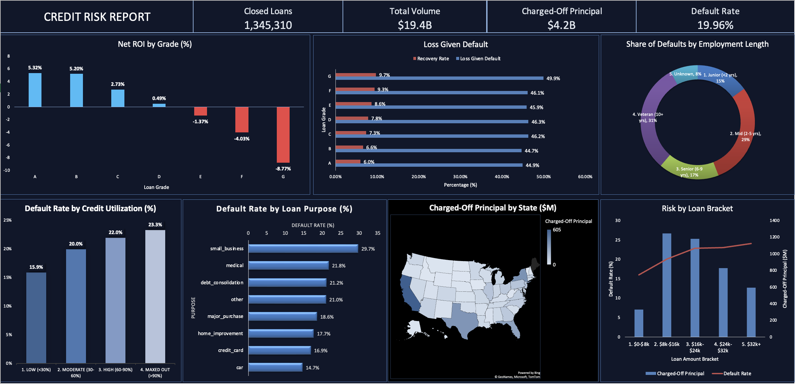
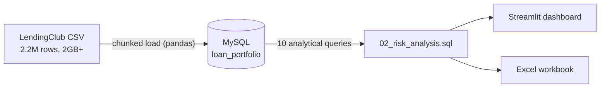

<h1 align="center">LendingClub Credit Risk & Yield Analysis</h1>

<p align="center">
  
  
  
  
</p>



> **An end-to-end analysis of 2.2 million LendingClub loans: from raw CSV to SQL to dashboards, answering one question: *where does a lender actually make or lose money?***

---

## At a Glance

| Closed loans analysed | Total funded | Charged-off principal | Portfolio default rate |
|:---:|:---:|:---:|:---:|
| **1,345,310** | **$19.4B** | **$4.18B** | **19.96%** |

*Only loans with a final outcome (Fully Paid or Charged Off) are analysed. Loans still in progress are excluded so results aren't distorted by unknown outcomes.*

---

## Key Findings

### 1. Higher interest rates did not pay off for the riskiest borrowers
Grades E, F and G charge the highest rates, yet they **lost money** once defaults were counted.

| Grade | A | B | C | D | E | F | G |
|---|---|---|---|---|---|---|---|
| **Net ROI** | 5.32% | 5.20% | 2.73% | 0.49% | **-1.37%** | **-4.03%** | **-8.77%** |

### 2. Defaults are expensive and barely recoverable
On defaulted loans, lenders lose roughly **45-50%** of the funded amount, and recover only **6-10%** afterwards. The loss severity is similar across grades, so the damage comes from the *higher number* of defaults in weaker grades.

### 3. Longer loans are twice as risky
| Term | Loans | Default rate |
|---|---|---|
| 36 months | 1,020,743 | **15.99%** |
| 60 months | 324,567 | **32.45%** |

60-month loans make up only **24%** of closed loans but account for **39%** of all defaults.

### 4. Debt-to-income (DTI) erases much of the credit-score advantage
Default rate (%) by FICO score and DTI:

| FICO band | Low DTI (<15%) | Moderate (15-25%) | High DTI (>25%) |
|---|:---:|:---:|:---:|
| Excellent (750+) | 7.89 | 8.67 | **13.12** |
| Good (700-749) | 12.62 | 15.42 | 21.11 |
| Fair (660-699) | 18.85 | 23.96 | 30.73 |

An *Excellent*-FICO borrower with high DTI (13.12%) defaults more often than a *Good*-FICO borrower with low DTI (12.62%). The DTI penalty also grows as credit score falls (+5.2, +8.5 and +11.9 percentage points).

### 5. Early-warning signals visible at origination
| Signal | Lowest-risk group | Highest-risk group |
|---|---|---|
| Credit utilization | <30% → **15.88%** | >90% → **23.32%** |
| Loan size | $0-8k → **16.06%** | $32k+ → **24.11%** |
| Loan purpose | car → **14.68%** | small_business → **29.71%** |

### What I'd recommend
- **Reprice or restrict Grades E-G**, since current rates don't compensate for losses.
- **Add DTI and utilization caps** to underwriting, even for high-FICO applicants.
- **Apply tighter approval rules to 60-month and small-business loans.**

---

## Dashboards

**Excel executive dashboard** (shown above): [`reports/Credit_Risk_Master.xlsx`](reports/Credit_Risk_Master.xlsx) contains the dashboard plus the 10 underlying result tables, all generated automatically from SQL.

**Streamlit app** (`src/dashboard.py`): an interactive local app with a KPI ribbon, share of defaults by term and employment length (doughnuts), default rates by loan purpose, utilization and loan size (bars), and charged-off principal by loan bracket and by state.

```bash
streamlit run src/dashboard.py
```

---

## How It Works



| Step | What happens | File |
|---|---|---|
| **1. Schema** | Creates the database and a typed `loan_portfolio` table (primary key, DECIMAL money columns, index on loan status) | `sql/01_schema.sql` |
| **2. Ingest** | Reads the 2GB CSV in 50,000-row chunks (memory-safe), keeps 25 relevant columns, drops blank rows, loads into MySQL | `src/ingest_data.py` |
| **3. Analyse** | 10 SQL queries cover KPIs, ROI, loss given default, FICO x DTI, utilization, term, employment, purpose, loan size and state | `sql/02_risk_analysis.sql` |
| **4. Visualise** | Streamlit app runs the SQL file and renders the charts | `src/dashboard.py` |
| **5. Report** | Exports every query result into a multi-tab Excel workbook | `src/export_to_excel.py` |

---

## Code Highlights

### Memory-safe ingestion of a 2GB file
```python
for chunk in pd.read_csv(CSV_PATH, usecols=COLUMNS_TO_KEEP,
                         chunksize=CHUNK_SIZE, low_memory=False):

    chunk = chunk.rename(columns=RENAME)
    chunk = chunk.dropna(subset=["loan_status"])   # drops blank / footer rows
    chunk.to_sql(TABLE, con=engine, if_exists="append", index=False)
```

### Typed schema (excerpt)
```sql
CREATE TABLE loan_portfolio (
    loan_id     VARCHAR(50) PRIMARY KEY,
    loan_amnt   DECIMAL(15, 2),
    grade       VARCHAR(5),
    loan_status VARCHAR(100),
    total_pymnt DECIMAL(15, 2),
    recoveries  DECIMAL(15, 2)
    -- ...25 columns in total
);
CREATE INDEX idx_status_grade ON loan_portfolio (loan_status, grade);
```

### Risk-adjusted return (ROI) by loan grade
```sql
SELECT
    grade,
    COUNT(loan_id)                                   AS total_closed_loans,
    ROUND(SUM(loan_amnt), 2)                         AS total_cap_dep,
    ROUND(SUM(total_pymnt) - SUM(loan_amnt), 2)      AS net_return,
    ROUND(((SUM(total_pymnt) - SUM(loan_amnt))
           / SUM(loan_amnt)) * 100, 2)               AS roi_percentage
FROM loan_portfolio
WHERE loan_status IN ('Fully Paid', 'Charged Off')
GROUP BY grade
ORDER BY grade ASC;
```

### Loss given default (LGD) and recovery rate
```sql
SELECT
    grade,
    COUNT(loan_id)                                              AS total_defaults,
    ROUND(AVG((loan_amnt - total_pymnt) / loan_amnt) * 100, 2)  AS avg_lgd_percentage,
    ROUND(AVG(recoveries / loan_amnt) * 100, 2)                 AS recovery_rate_percentage
FROM loan_portfolio
WHERE loan_status = 'Charged Off'
GROUP BY grade
ORDER BY grade ASC;
```

### Default rate by loan term
```sql
SELECT
    term,
    COUNT(loan_id) AS total_loans,
    ROUND((SUM(CASE WHEN loan_status = 'Charged Off' THEN 1 ELSE 0 END)
           / COUNT(loan_id)) * 100, 2) AS default_rate
FROM loan_portfolio
WHERE loan_status IN ('Fully Paid', 'Charged Off') AND term IS NOT NULL
GROUP BY term
ORDER BY term;
```

---

## Project Structure

```
lending-club-credit-risk/
├── .github/workflows/
│   └── ci.yml                 # lint + tests on every pull request
├── assets/
│   └── dashboard.png          # dashboard screenshot
├── data/                      # put the Kaggle CSV here (git-ignored)
├── reports/
│   └── Credit_Risk_Master.xlsx   # Excel dashboard + result tables
├── sql/
│   ├── 01_schema.sql          # database + typed table
│   └── 02_risk_analysis.sql   # the 10 analytical queries
├── src/
│   ├── db.py                  # shared DB connection + SQL loader
│   ├── ingest_data.py         # chunked CSV -> MySQL pipeline
│   ├── export_to_excel.py     # SQL results -> Excel workbook
│   └── dashboard.py           # Streamlit app
├── tests/
│   └── test_sql_queries.py    # smoke tests for the 10 queries
├── .env.example               # template for database credentials
├── pytest.ini
├── requirements.txt
└── README.md
```

---

## Run It Yourself

**1. Clone and install**
```bash
git clone https://github.com/YashSharma333/lending-club-credit-risk.git
cd lending-club-credit-risk
pip install -r requirements.txt
```

**2. Get the data.** Download the LendingClub *accepted loans* file (`accepted_2007_to_2018Q4.csv`) from [Kaggle](https://www.kaggle.com/datasets/wordsforthewise/lending-club) and put it in a `data/` folder in the project root. (It is too large for GitHub.)

**3. Create the database and table**
```bash
mysql -u <your_user> -p < sql/01_schema.sql
```

**4. Add your credentials.** Copy `.env.example` to `.env` and fill in your MySQL details:
```env
DB_USER=your_user
DB_PASSWORD=your_password
DB_HOST=localhost
DB_NAME=lending_portfolio
```

**5. Load, analyse, view**
```bash
python src/ingest_data.py        # loads ~2.2M rows into MySQL
python src/export_to_excel.py    # exports all 10 result tables to reports/Credit_Risk_Data.xlsx
streamlit run src/dashboard.py   # launches the dashboard
pytest                           # optional: runs the SQL smoke tests
```

---

## Method Notes and Limitations

- **ROI** = (total payments received - amount funded) / amount funded, per grade. It is a *lifetime, non-annualised* return on closed loans.
- **Default** = loan status of *Charged Off*. **"Capital at Risk"** on the dashboard = the funded amount of charged-off loans.
- **LGD** = share of the funded amount not repaid on defaulted loans (net of payments received).
- **Closed loans only.** Loans still active are excluded. This is a standard choice, but it under-represents recent 60-month loans, so term comparisons should be read with that in mind.
- **FICO "Poor (<660)" bracket is almost empty** (2 loans) because LendingClub did not originate below that score.
- Findings show association, not causation. For example, 60-month loans are more common in weaker grades, so term and grade effects overlap.

---

## Possible Next Steps
- Add vintage (origination-year) analysis
- Build a probability-of-default model (logistic regression)
- Add database indexes and automated tests

---

## About

Built by **Yash Sharma** as a hands-on credit risk and SQL analytics project.

[GitHub](https://github.com/YashSharma333) · [LinkedIn](https://www.linkedin.com/in/shamrayash/)
